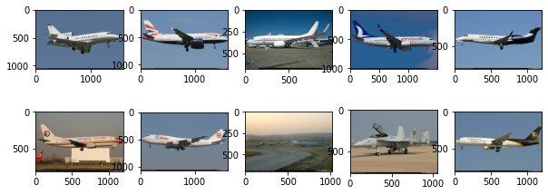

# Aircraft_spotter

This repo has two main objectives :

- first create a CNN to recognize aircrafts
- secondly create a program to localize on a satelite image aircrafts of interest

Finally, we could combine both and apply it on main airbase of a built database.

## Find aircaft database

[FGVC database](https://www.robots.ox.ac.uk/~vgg/data/fgvc-aircraft/) as Fine Grained Visual Classification of Aircrafts.
Following Fine-Grained Visual Classification of Aircraft, S. Maji, J. Kannala, E. Rahtu, M. Blaschko, A. Vedaldi, arXiv.org, 2013
However this database is not adapted, aircraft are seen from edge, and we seek more an satelitte view.

[Planet Satellite ImageShip](https://www.kaggle.com/rhammell/planesnet) has the satelittte view. But images are of poor quality. This is done to localize planes on satelittes images. So more for the **second task**.

